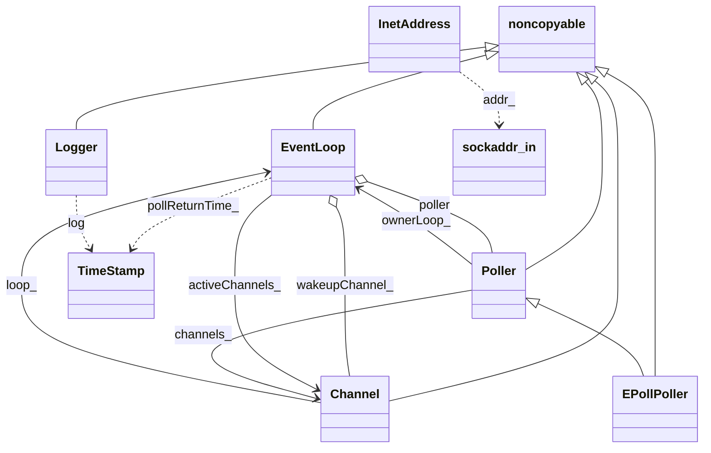

# 类图规范（面向 StarUML）

本文档列出当前网络库中参与类图的类：名称、属性、方法及与其它类的关系，便于在 StarUML 中新建 Class Diagram 后逐项添加。文末附 Mermaid 源码，可用 VSCode / GitHub 预览。

---

## 1. noncopyable

- **说明**：混入基类，禁止拷贝与赋值；无数据成员。
- **方法**：`noncopyable(const noncopyable&) = delete`，`operator=(const noncopyable&) = delete`（protected：默认构造/析构）。
- **关系**：EventLoop、Poller、Channel、Logger 继承自 noncopyable。

---

## 2. EventLoop

- **说明**：单线程事件循环核心，持有 Poller 与 wakeup 用 Channel，维护活跃 Channel 列表与待执行任务。
- **属性**：
  - `looping_ : atomic_bool`
  - `quit_ : atomic_bool`
  - `threadId_ : pid_t`
  - `pollReturnTime_ : TimeStamp`
  - `poller : unique_ptr<Poller>`
  - `wakeupFd_ : int`
  - `wakeupChannel_ : unique_ptr<Channel>`
  - `activeChannels_ : vector<Channel*>`
  - `currentActiveChannel_ : Channel*`
  - `callingPendingFunctors_ : atomic_bool`
  - `pendingFunctors_ : vector<Functor>`
  - `mutex_ : mutex`
- **方法**：
  - `EventLoop()`, `~EventLoop()`
  - `void loop()`, `void quit()`
  - `TimeStamp pollReturnTime() const`
  - `void runInLoop(Functor cb)`, `void queueInLoop(Functor cb)`
  - `void wakeup()`
  - `void updateChannel(Channel*)`, `void removeChannel(Channel*)`, `bool hasChannel(Channel*)`
  - `bool isInLoopThread() const`
- **关系**：
  - 继承 noncopyable。
  - 组合：拥有 Poller（poller）、Channel（wakeupChannel_）。
  - 聚合：activeChannels_ 引用多个 Channel*。
  - 依赖：TimeStamp（pollReturnTime_）、CurrentThread（isInLoopThread）。

---

## 3. Poller

- **说明**：多路复用抽象基类，管理 fd → Channel* 映射，提供 poll / updateChannel / removeChannel 接口。
- **属性**：
  - `channels_ : unordered_map<int, Channel*>`（protected）
  - `ownerLoop_ : EventLoop*`（private）
- **方法**：
  - `Poller(EventLoop*)`, `virtual ~Poller()`
  - `virtual TimeStamp poll(int timeoutMs, ChannelList* activeChannels) = 0`
  - `virtual void updateChannel(Channel*) = 0`, `virtual void removeChannel(Channel*) = 0`
  - `bool hasChannel(Channel*) const`
  - `static Poller* newDefaultPoller(EventLoop*)`
- **关系**：
  - 继承 noncopyable。
  - 关联 EventLoop（ownerLoop_）。
  - 聚合：channels_ 以 fd 为键引用 Channel*。
  - 被 EPollPoller 继承。

---

## 4. EPollPoller

- **说明**：基于 epoll 的 Poller 实现。
- **属性**：
  - `epollfd_ : int`
  - `events_ : vector<epoll_event>`
  - `kInitEventListSize : const int`（静态常量）
- **方法**：
  - `EPollPoller(EventLoop*)`, `~EPollPoller() override`
  - `TimeStamp poll(int timeoutMS, ChannelList* activeChannels) override`
  - `void updateChannel(Channel*) override`, `void removeChannel(Channel*) override`
  - `void fillActiveChannels(int numEvents, ChannelList* activeChannels) const`, `void update(int operation, Channel*)`（private）
- **关系**：继承 Poller。

---

## 5. Channel

- **说明**：将 fd 与关心的事件及读/写/关闭/错误回调绑定，由 EventLoop 在 poll 返回后调用 handleEvent。
- **属性**：
  - `loop_ : EventLoop*`
  - `fd_ : int`
  - `events_ : int`, `revents_ : int`, `index_ : int`
  - `tie_ : weak_ptr<void>`, `tied_ : bool`
  - `readCallback_ : ReadEventCallback`, `writeCallback_ : EventCallback`, `closeCallback_ : EventCallback`, `errorCallback_ : EventCallback`
  - `kNoneEvent`, `kReadEvent`, `kWriteEvent`（静态常量）
- **方法**：
  - `Channel(EventLoop*, int fd)`, `~Channel()`
  - `void handleEvent(TimeStamp receiveTime)`
  - `setReadCallback(ReadEventCallback)`, `setWriteCallback(EventCallback)`, `setCloseCallback(EventCallback)`, `setErrorCallback(EventCallback)`
  - `void tie(const shared_ptr<void>&)`
  - `int fd() const`, `int events() const`, `void set_revents(int)`, `bool isNonEvents() const`
  - `enableReading()`, `disableReading()`, `enableWriting()`, `disableWriting()`, `disableAll()`, `bool isWriting() const`, `bool isReading() const`
  - `int index()`, `void set_index(int)`
  - `EventLoop* ownerLoop()`, `void remove()`
- **关系**：
  - 继承 noncopyable。
  - 关联 EventLoop（loop_）。
  - 被 Poller 的 channels_ 引用，被 EventLoop 的 activeChannels_ 与 wakeupChannel_ 引用。

---

## 6. Logger

- **说明**：单例日志类，按级别输出并附带时间戳。
- **属性**：`logLevel_ : int`
- **方法**：`static Logger& instance()`, `void setLogLevel(int)`, `void log(string msg)`
- **关系**：继承 noncopyable；依赖 TimeStamp（在 log 中打时间）。

---

## 7. TimeStamp

- **说明**：时间戳封装，提供 now() 与 toString()。
- **属性**：`microSecondsSinceEpoch_ : int64_t`
- **方法**：`TimeStamp()`, `explicit TimeStamp(int64_t)`, `static TimeStamp now()`, `string toString() const`
- **关系**：被 EventLoop（pollReturnTime_）、Logger 使用；无继承/组合。

---

## 8. InetAddress

- **说明**：IPv4 地址封装，包装 sockaddr_in。
- **属性**：`addr_ : sockaddr_in`
- **方法**：`explicit InetAddress(uint16_t port, string ip)`, `explicit InetAddress(const sockaddr_in&)`, `string toIp() const`, `string toIpPort() const`, `uint16_t toPort() const`, `const sockaddr_in* getSockAddr() const`
- **关系**：依赖 sockaddr_in（可画为系统类型或注释）；被 TcpServer / Socket 等使用。

---

## 9. TcpServer

- **说明**：占位类，当前无成员。
- **属性**：（无）
- **方法**：（无）
- **关系**：预留与 EventLoop、InetAddress、Acceptor、TcpConnection 等的关系，后续实现时补充。

---

## 10. CurrentThread（命名空间/工具）

- **说明**：提供当前线程 tid 的缓存与查询，非类图主实体，可与 EventLoop 画一条“使用”依赖。
- **关系**：EventLoop::isInLoopThread() 使用 CurrentThread::tid()。

---

## Mermaid 类图源码（预览用）

可将下面代码块复制到支持 Mermaid 的编辑器中预览（如 VSCode 的 Mermaid 插件、GitHub Markdown）。

**StarUML 绘制提示**：新建 Class Diagram，按上表逐个创建类并添加属性/方法；使用「Inheritance」连接 noncopyable → EventLoop/Poller/Channel/Logger 以及 Poller → EPollPoller；使用「Composition」或「Aggregation」表示拥有/引用关系；使用「Dependency」表示对 TimeStamp 等的使用。
