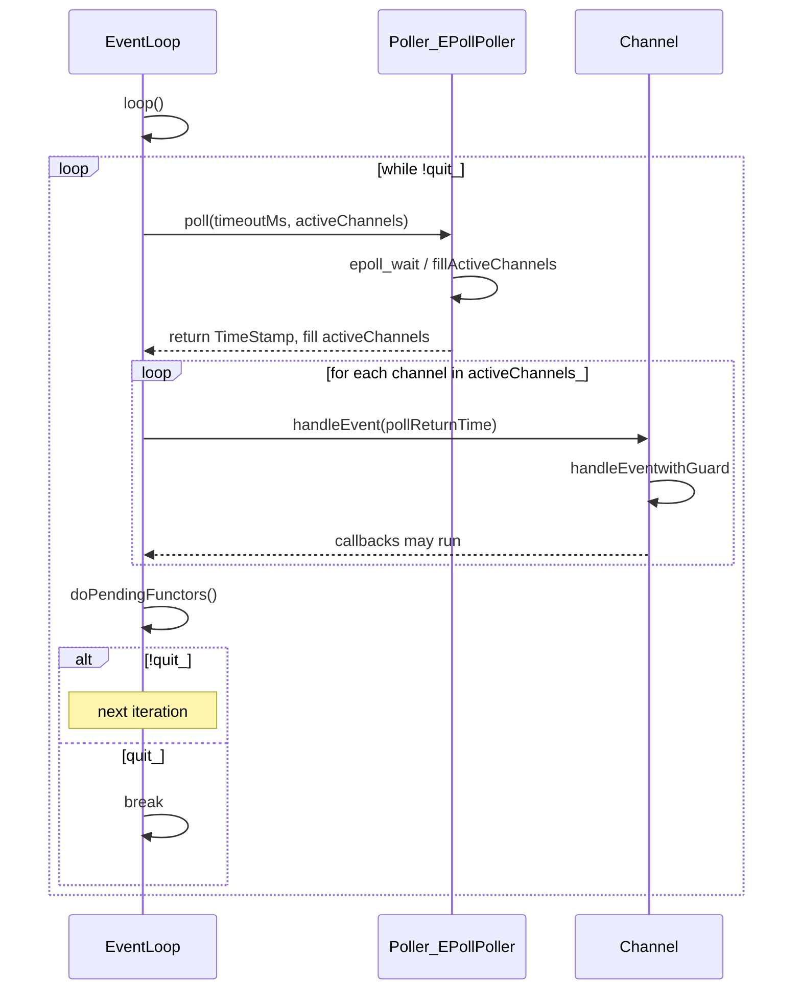
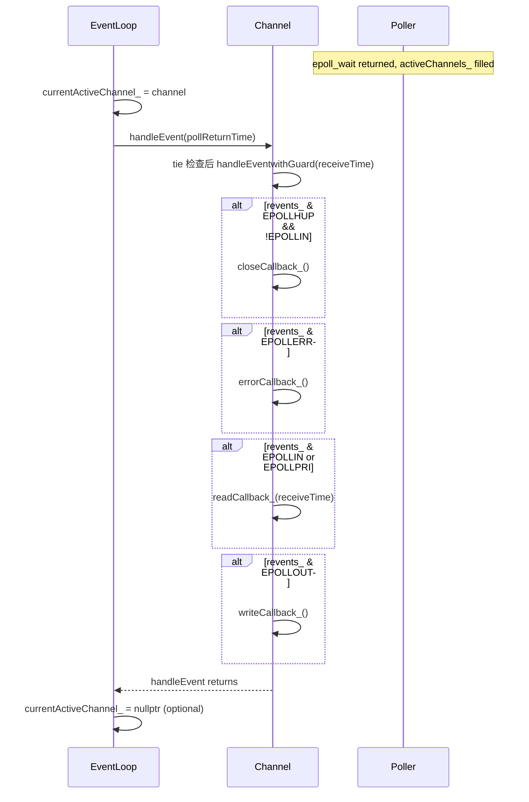

# 时序图（面向 StarUML）

本文档给出两个核心流程的时序图：① 事件循环一轮 ② Channel 事件处理。每节包含目的说明、Mermaid 源码及在 StarUML 中绘制的简要步骤。

---

## 1. 事件循环一轮

**目的**：描述 `EventLoop::loop()` 在一次迭代中的流程：调用 Poller 阻塞等待 I/O，得到就绪 Channel 列表后逐个分发事件，然后处理跨线程投递的待执行任务，若未 quit 则进入下一轮。

**参与对象**：EventLoop、Poller（可具体化为 EPollPoller）、Channel（代表“当前被处理的一个 Channel”）。

**StarUML 绘制提示**：

- 在 Sequence Diagram 中创建三个 Lifeline：`EventLoop`、`Poller`（或 `EPollPoller`）、`Channel`。
- 从 EventLoop 到自身的 `loop()` 作为入口；然后 EventLoop → Poller：`poll(timeoutMs, activeChannels)`，Poller 返回（reply）填满 activeChannels 并返回时间戳。
- 用 Loop 片段（或注释）表示“遍历 activeChannels_”：EventLoop → Channel：`handleEvent(receiveTime)`，Channel 内部调用 `handleEventwithGuard` 及各类回调。
- 接着 EventLoop → 自身：`doPendingFunctors()`；用 Alt 表示 quit_ 为真时退出循环，否则进入下一轮。

---

## 2. Channel 事件处理

**目的**：细化“Poller 返回就绪 fd 之后”的流程：EventLoop 从 activeChannels 取出 Channel，设置当前活跃 Channel（可选），调用 `Channel::handleEvent`；Channel 根据 `revents_` 依次触发 close / error / read / write 回调。

**参与对象**：EventLoop、Channel、Poller（仅表示“已返回就绪事件”的状态）。

**StarUML 绘制提示**：

- 创建 Lifeline：`EventLoop`、`Channel`、`Poller`（可用 Note 说明“Poller 已返回”）。
- EventLoop → Channel：`handleEvent(pollReturnTime)`；Channel → Channel：`handleEventwithGuard(receiveTime)`。
- 用多个 Alt 片段表示根据 `revents_` 分支调用：`closeCallback_()`、`errorCallback_()`、`readCallback_(receiveTime)`、`writeCallback_()`（与 [Channel.cc](../Channel.cc) 中 handleEventwithGuard 顺序一致）。
- 最后 Channel 返回，EventLoop 可选择性清除 currentActiveChannel_。

---

## 使用方式

- **预览**：将上述 Mermaid 代码块复制到支持 Mermaid 的编辑器（如 VSCode 插件、GitHub）中查看。
- **在 StarUML 中复现**：新建 Sequence Diagram，按“StarUML 绘制提示”添加 Lifeline 与消息顺序；Loop/Alt 可用 CombinedFragment 的 loop / alt 类型表示。
